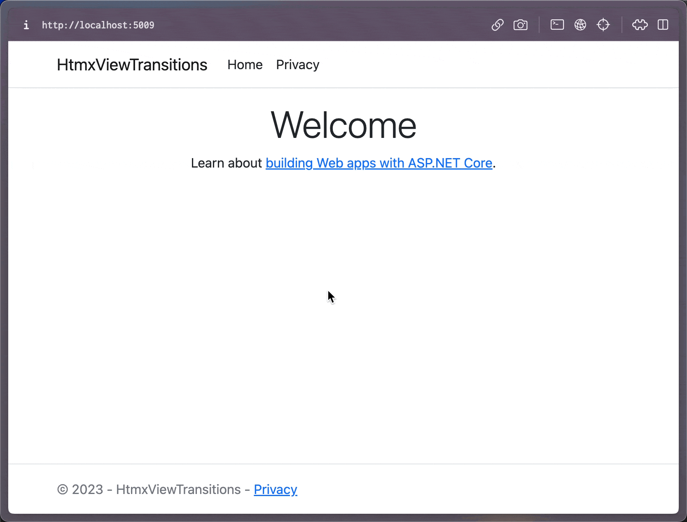

# ASP.NET Core Razor Pages, HTMX, and View Transitions

This is a small sample showing how to add a view transitions
between Razor pages with just a few steps. This readme will just
point out the important parts, but I'll write a blog post which
will eventually publish at https://khalidabuhakmeh.com so stay tuned.

## Important Parts

1. HTMX 1.9.6+
2. The use of [`hx-boost` in `_Layout.cshtml`](./HtmxViewTransitions/Pages/Shared/_Layout.cshtml#L12)
3. The use of `hx-swap` with a value of `transition:true`
4. Animation keyframes and View Transition CSS in [site.css](./HtmxViewTransitions/wwwroot/css/site.css)

Keep in mind that `hx-boost` hijacks all anchor tags and will replace the existing body with a new incoming body. You
can limit where this happens by wrapping `hx-boost` around a specific set of elements. For this demo, all links are
hijacked. Try out the main menu and the footer links.

## Final Result

## License

Copyright © 2023 Khalid Abuhakmeh

Permission is hereby granted, free of charge, to any person obtaining a copy of this software and associated
documentation files (the “Software”), to deal in the Software without restriction, including without limitation the
rights to use, copy, modify, merge, publish, distribute, sublicense, and/or sell copies of the Software, and to permit
persons to whom the Software is furnished to do so, subject to the following conditions:

The above copyright notice and this permission notice shall be included in all copies or substantial portions of the
Software.

THE SOFTWARE IS PROVIDED “AS IS”, WITHOUT WARRANTY OF ANY KIND, EXPRESS OR IMPLIED, INCLUDING BUT NOT LIMITED TO THE
WARRANTIES OF MERCHANTABILITY, FITNESS FOR A PARTICULAR PURPOSE AND NONINFRINGEMENT. IN NO EVENT SHALL THE AUTHORS OR
COPYRIGHT HOLDERS BE LIABLE FOR ANY CLAIM, DAMAGES OR OTHER LIABILITY, WHETHER IN AN ACTION OF CONTRACT, TORT OR
OTHERWISE, ARISING FROM, OUT OF OR IN CONNECTION WITH THE SOFTWARE OR THE USE OR OTHER DEALINGS IN THE SOFTWARE.

